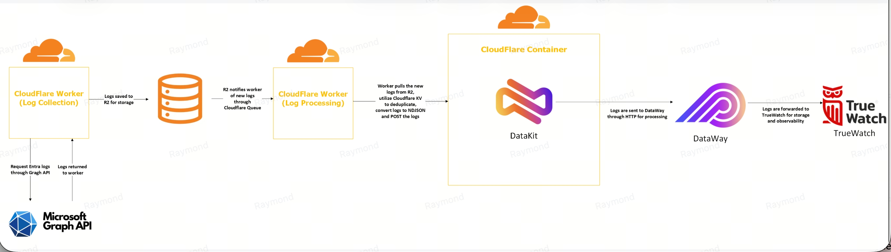

# TrueWatch M365 Cloudflare Workers

**Microsoft 365 Log Collection and Forwarding via Cloudflare Workers**

A set of Cloudflare Workers that collect Microsoft 365 audit logs, application inventory, unified audit logs, and license data — and forward them into [TrueWatch](https://truewatch.com) for observability and monitoring.

---

## Overview

This project bridges your Microsoft 365 tenant and TrueWatch using serverless infrastructure on Cloudflare. It runs entirely on Cloudflare Workers, R2, KV, Queues, and Containers — no servers to manage.

Each log source follows the same pattern: a **Collector** Worker pulls data from Microsoft APIs on a cron schedule, stores raw batches in R2, and hands off to a **Processor** Worker via Queues. The Processor deduplicates, transforms, and forwards logs to TrueWatch through a self-hosted DataKit container.

---

## Architecture

---

## Workers

| Worker | Type | Schedule | Source API |
|---|---|---|---|
| `entra-log-collector` | Collector | Every 2 min | Microsoft Graph — Entra audit & sign-in logs |
| `entra-log-processor` | Processor | Queue-driven | — |
| `entra-app-inventory-collector` | Collector | Every 2 min | Microsoft Graph — App registrations & secrets |
| `entra-app-inventory-processor` | Processor | Queue-driven | — |
| `o365-unified-log-collector` | Collector | Every 2 min | Office 365 Management Activity API |
| `o365-unified-log-processor` | Processor | Queue-driven | — |
| `m365-license-collector` | Collector | Scheduled | Microsoft Graph — Subscribed SKUs |
| `m365-license-processor` | Processor | Queue-driven | — |
| `datakit` | Gateway | Always-on container | — |

---

## How It Works

### 1 — Collection
Each Collector Worker runs on a cron trigger and authenticates to Microsoft APIs using App Registration client credentials (Tenant ID, Client ID, Client Secret). Raw log batches are written as JSON objects to a shared R2 bucket (`m365-logs`) under prefixed paths. A KV namespace stores the collection cursor so each run resumes from where the last left off.

The Entra log collector intentionally re-fetches the previous 15 minutes on every run to catch events that appear late in Microsoft Graph. Deduplication downstream ensures no duplicate records reach TrueWatch.

### 2 — Queue Handoff
R2 Event Notifications fire automatically when new objects land in the bucket. Each prefix is routed to its corresponding Cloudflare Queue, decoupling collection from processing. This means a processing failure does not affect collection, and failed messages can be retried independently.

### 3 — Processing
Each Processor Worker consumes messages from its queue, reads the referenced R2 object, deduplicates records against a KV namespace, transforms the records into NDJSON, and forwards them to the DataKit Worker via a Service Binding — keeping all internal traffic within Cloudflare.

### 4 — Ingestion into TrueWatch
The DataKit Worker fronts a DataKit container running in Cloudflare Containers via a Durable Object. DataKit receives the NDJSON payload and forwards it to your TrueWatch workspace via the configured DataWay URL.

---

## Cloudflare Resources Used

| Resource | Purpose |
|---|---|
| **Workers** | Collector and Processor logic |
| **Cron Triggers** | Schedule Collectors every 2 minutes |
| **R2** | Raw log landing zone (`m365-logs` bucket) |
| **R2 Event Notifications** | Trigger Processor Workers on new objects |
| **Queues** | Decouple collection from processing |
| **KV** | Cursors (collectors) and dedup markers (processors) |
| **Service Bindings** | Internal Worker-to-Worker routing to DataKit |
| **Durable Objects** | Stable coordination point for the DataKit container |
| **Containers** | Hosts the DataKit process |

---

## Why This Architecture

- **R2 as raw landing zone** — preserves original payloads for replay, recovery, and auditability
- **Queues for decoupling** — collection and processing fail independently and retry separately
- **15-minute overlap on Entra logs** — Microsoft Graph surfaces some events late; the design favors completeness and deduplicates downstream
- **Service Bindings for internal routing** — processor-to-DataKit traffic stays inside Cloudflare, no public endpoint needed
- **Containers for DataKit** — DataKit is a full process, not a stateless function; Durable Objects provide a stable front end

---

## Prerequisites

- Cloudflare account on the **Workers Paid plan** ($5/month)
- Microsoft 365 tenant with an Entra ID App Registration
- TrueWatch account with a DataWay URL and token
- Docker Desktop (for building the DataKit container image)

---

## Cost Estimate

| Component | Cost |
|---|---|
| Workers, R2, KV, Queues | Covered by $5/month tier |
| DataKit container (standard-2) | ~$40–$50 USD/month additional |
| **Total estimate** | **~$45–$55 USD/month** |

---

## Getting Started

See **[SETUP.md](./SETUP.md)** for the full step-by-step setup guide, including:
- Creating the R2 bucket, KV namespaces, and Queues
- Configuring R2 Event Notification rules
- App Registration and required Microsoft API permissions
- Deploying the DataKit container and all Workers
